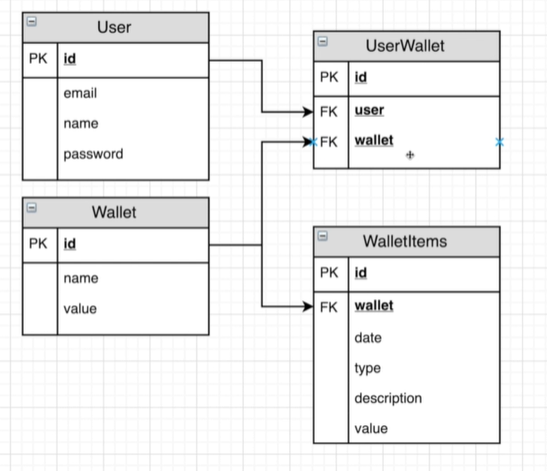

# wallet

Esse projeto possui as seguintes características:

-> Projeto criado com Spring Boot e Java 8
-> Banco de dados Postgres com JPA e Spring Data JPA
-> Versionamento de banco de dados com Flyway
-> Testes com JUnit e Mockito com banco H2 em memória
-> Caching com EhCache
-> Nuvem do Heroku
-> Integração contínua com TravisCI
-> Project Lombok
-> Documentação dos endpoints com Swagger
-> Segurança da API com autenticação via tokens JWT

